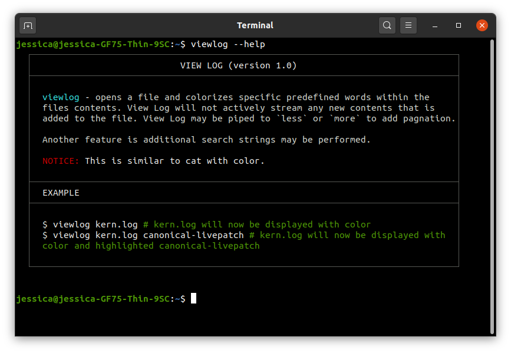

# Help Arguments

If you don’t know how to use a command i.e. you don’t know about its parameters and return type etc, then you can make use of the Help argument ```-h``` or ```--help``` after any command. By using one of these arguments after a command will show an overview of that command and any additional arguments that may be used or required. To use simply type the command whose usage you would like to find information from by using the terminal with ```-h``` or ```--–help``` after a space and press enter.



___
[](home.md) [Home](home.md)
___

___
>>>
## References

- This document leveraged heavily from the [Markdown-Cheatsheet](https://github.com/adam-p/markdown-here/wiki/Markdown-Cheatsheet).
- The original [Markdown Syntax Guide](https://daringfireball.net/projects/markdown/syntax)
  at Daring Fireball is an excellent resource for a detailed explanation of standard Markdown.
- The detailed specification for CommonMark can be found in the [CommonMark Spec](https://spec.commonmark.org/current/)
- The [CommonMark Dingus](http://try.commonmark.org) is a handy tool for testing CommonMark syntax.
>>>
___