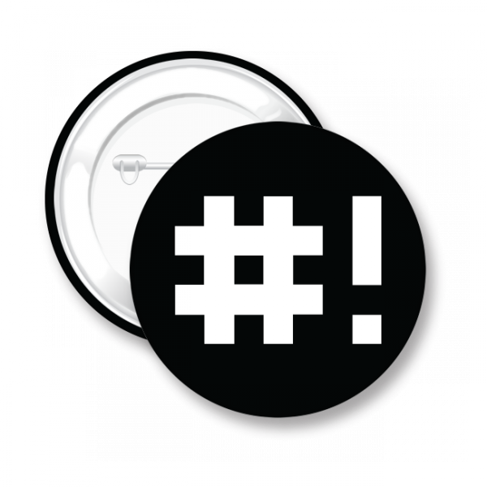

#  Modular and Library enforced BASH helper 

## What is this?
 **Enhanced BASH System**, started in theory and became multiple scripts all over my system and now has been developed over a very long time for ease of use. Although this particular version is still fairly new. Over the past decade I have been collecting, building, customizing and designing scripts to make my terminal experience easier to use by reducing mundane commands and make it as universal between different distributions of Linux.

Upon building this version, I started building shell scripts at work on [Oracle Linux](https://www.oracle.com/linux/) (RHEL distro), which later switched to [RedHat](https://www.redhat.com/) 8. At home I prefer to use [Debian](https://www.debian.org/) Linux, and finally experimented with [Gentoo](https://www.gentoo.org/) and [ZSH](http://zsh.sourceforge.net/) on my home lab. The latter was a mistake for me and I wish I could have taken it all back. So let's talk about that horror show later. :stuck_out_tongue_closed_eyes:

Because the majority of the development of this script has been from home (since it seems out of 1200 people at work there is always a fire to put out), much of my testing has been done on a [custom made](http://www.linuxfromscratch.org/) Debian distro. I have researched and [Googled](https://www.google.com/), used [Stack Overflow](http://www.stackoverflow.com/), and talked with other admins about compatibility, including fetching a new version on my work PC once a week. So far so good.

Something very important to say here, although I have came up with the concept of this modular approach, I have not 100% created each of these scripts, although I have created some of them. As I continue to build this system, I will be going through and giving credit to each of those people for their scripts. This was once in mind just a way to keep some of the scripts I found throughout the internet and use them for my personal use. I believe this concept is too good of an idea to let it not be shared. If you are someone who has created one of the scripts in this, please let me know if you approve of me using and so I can give you credit where it is due.

## The Concept
I have been borrowing other peoples scripts, building my own script, using different environments for root, development and it seems like my Linux commands would change and then I would forget, and then I feel like a noob scouring the net to find the right argument for this particular distro and version. I wanted to have the ability to have a configuration file that can be easily modified when I change locations or servers I do not have to modify the code in a million different places to match my location. I work in one city and live in another, one of my modules is a nice little weather and calendar function. By changing the city in the config file updates all of my other geo-location information.

## The Modular Way

So I started to build this more in a modular way, the [Modular](modules.md) Wiki will give more details on this Programs setup and development options. With the modules folder and scripts that do not rely on other modules. Where as, I can add and remove modules on the fly without affecting the integrity of the script.

## Library Folder

This is where the Library folder comes into play, adding constants into the lib_* files allows modules to use features throughout their script. A Module may contain both a mod_* file and lib_* file. No other module should rely on any other module's library file.

## Help Topics Menu
|   |   |   |
|---|---|---|
|  [Help arguments](help-arguments.md)  |   [Help Screen](help-screen.md)  |   [Contributing](contributing.md)  |
|  [Aliases](aliases.md)                            |   [Modules](modules.md) |  [Libraries](libraries.md)  |
|  [Over Rides](over-rides.md)  |   [Logs](logs.md)  |   [Installation](installation.md) |

___
>>>
## References

- This document leveraged heavily from the [Markdown-Cheatsheet](https://github.com/adam-p/markdown-here/wiki/Markdown-Cheatsheet).
- The original [Markdown Syntax Guide](https://daringfireball.net/projects/markdown/syntax)
  at Daring Fireball is an excellent resource for a detailed explanation of standard Markdown.
- The detailed specification for CommonMark can be found in the [CommonMark Spec](https://spec.commonmark.org/current/)
- The [CommonMark Dingus](http://try.commonmark.org) is a handy tool for testing CommonMark syntax.
>>>
___